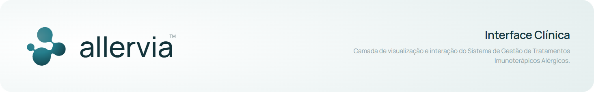

# Allervia · Interface Clínica

**Camada de visualização e interação do Sistema de Gestão de Tratamentos Imunoterápicos Alérgicos.**



> **Escopo deste repositório:** aqui vive exclusivamente a interface clínica do Allervia, a aplicação web em React operada pelos profissionais da clínica. O **back-end** (API, persistência, autenticação e regras de servidor) não faz parte deste repositório e será mantido em base própria; enquanto não existe integração, a interface opera sobre dados semeados em memória.

Plataforma de gestão clínica dedicada a consultórios de alergologia que conduzem protocolos de imunoterapia específica, nas modalidades **subcutânea (SCIT)** e **sublingual (SLIT)**. Oferece prontuário eletrônico estruturado, agenda terapêutica, cálculo automático de progressão de doses, encerramento assistido de tratamento, emissão de relatórios clínicos e trilha de auditoria em conformidade com a LGPD.

> **Origem e continuidade:** este repositório foi constituído a partir da versão privada anterior do produto (repositório interno predecessor, à época sob a denominação ImuneCare), consolidando o estado maduro das funcionalidades estáveis em uma base unificada e arquiteturalmente coerente. A partir deste ponto, toda a evolução subsequente do sistema (novas funcionalidades, refatorações estruturais, correções, melhorias de produto e releases oficiais) passa a ocorrer exclusivamente neste repositório, que assume o papel de fonte única da verdade do projeto.

> **Evolução contínua:** as funcionalidades, regras de negócio, protocolos clínicos e políticas de acesso descritas neste documento encontram-se em processo permanente de revisão, refinamento e amadurecimento, acompanhando o avanço do futuro produto, o retorno de profissionais de saúde envolvidos na validação clínica e eventuais atualizações normativas. Portanto, comportamentos atualmente implementados serão ajustados, expandidos ou reescritos em ciclos futuros; esta documentação reflete o estado vigente do sistema, não um contrato estático.

> **Estado atual dos dados:** todo o estado é mantido em stores Zustand com dados semeados em memória (perfis, imunoterapias, aplicações, notificações e trilha de acessos). Nenhuma chamada de rede é feita nesta fase; a substituição por chamadas à API do back-end e a persistência real serão introduzidas em ciclo posterior.

---

## Sumário

- [Visão geral](#visão-geral)
- [Stack](#stack)
- [Arquitetura](#arquitetura)
- [Começando](#começando)
- [Scripts](#scripts)
- [Features principais](#features-principais)
- [Controle de acesso](#controle-de-acesso-rbac)
- [Protocolo SCIT](#protocolo-scit)
- [Conformidade LGPD](#conformidade-lgpd)
- [Estrutura de pastas](#estrutura-de-pastas)

---

## Visão geral

O Allervia centraliza e digitaliza o fluxo assistencial de clínicas de alergologia, articulando em um mesmo ambiente as dimensões clínicas, operacionais e regulatórias do acompanhamento longitudinal de pacientes em imunoterapia:

- Prontuário eletrônico completo do paciente sob protocolo de imunoterapia, com histórico integral de aplicações
- Progressão automatizada do tratamento, calculando dose e intervalo da próxima aplicação conforme a fase em curso
- Agenda terapêutica com visões semanal e mensal
- Evolução assistida em etapas (seleção do paciente, pré-aplicação, pós-aplicação, revisão clínica)
- Encerramento assistido de tratamento, com métricas de desfecho e plano pós-alta
- Dashboard em duas camadas: painel geral de indicadores operacionais e panorama clínico analítico
- Emissão de relatórios clínicos (PDF, Excel ou CSV) e pacotes de portabilidade de dados em conformidade com a LGPD
- Controle de acesso granular por perfil profissional, com trilha de auditoria de todos os acessos a dados sensíveis

---

## Stack

- **React 19** + **TypeScript** (strict)
- **Vite**: bundler e dev server
- **TanStack Router**: roteamento file-based
- **Zustand**: state management
- **React Hook Form** + **Zod** (via `@hookform/resolvers`): formulários e validação
- **Tailwind CSS 4**: estilização (`class-variance-authority`, `tailwind-merge`, `tw-animate-css`)
- **Radix UI**: primitives acessíveis (dialog, select, dropdown, separator, label)
- **Recharts**: gráficos do dashboard
- **date-fns** (locale `ptBR`) e **react-day-picker**: datas e seletores de período
- **jsPDF**: geração de relatórios em PDF
- **GSAP** e **OGL**: animações e efeitos visuais da landing page
- **FontAwesome** e **Hugeicons**: iconografia

---

## Arquitetura

O código é organizado em **feature modules** + camadas compartilhadas:

```
src/
├── features/          Domínios de negócio (autocontidos)
│   ├── auth/          Login, cadastro em etapas, recuperação de senha e trial
│   ├── dashboard/     Painel geral, panorama clínico e exportação de relatórios
│   ├── immunotherapy/ Lista, cadastro em etapas, tipos customizáveis e protocolo SCIT
│   ├── landing-page/  Landing page, seções e alternância de tema
│   ├── notification/  Central de notificações
│   ├── patient/       Prontuário, evolução, encerramento, relatório e exportadores
│   ├── scheduling/    Agenda terapêutica (visões semanal e mensal)
│   └── settings/      Configurações (perfil, times, segurança, planos, ajuda, etc.)
├── shared/
│   ├── components/    Primitives sem contexto de domínio (forms, modals, toasts,
│   │                  wizard, tables, showcase) + barrel `index.ts`
│   ├── constants/     Constantes transversais (contato, meses, planos)
│   ├── hooks/         Hooks genéricos (countdown, scroll, guarda de alterações)
│   ├── layout/        AppShell, header, sidebar e store da sidebar
│   ├── lib/           Utilidades (cn, datas, máscaras, formatters, download, WhatsApp)
│   └── stores/        Stores globais (usuário/RBAC e trilha de auditoria)
├── routes/            TanStack Router (file-based)
├── assets/            Imagens, logos, landing art
└── main.tsx
```

**Princípios:**

- Cada feature é autocontida e segue a mesma subdivisão interna: `components/`, `constants/`, `hooks/`, `schemas/` e `stores/`, com as páginas na raiz da feature
- Estado de domínio vive em stores Zustand da própria feature; apenas usuário/RBAC e auditoria são globais (`shared/stores`)
- `shared/components` contém primitives sem contexto de domínio, reexportados pelo barrel `@/shared/components`
- `shared/components/showcase` concentra os tokens e primitives da linguagem visual v2 (`PageHeader`, `Pill`, `SHOWCASE`)
- Routes ficam em `src/routes/` (TanStack Router gera `routeTree.gen.ts`)
- Todos imports usam alias `@/*` → `./src/*`

---

## Começando

### Pré-requisitos

- Node.js 20+
- npm / pnpm / yarn

### Instalação

```bash
npm install
```

### Desenvolvimento

```bash
npm run dev
```

A aplicação sobe em `http://localhost:5173` (padrão Vite).

### Build de produção

```bash
npm run build
npm run preview
```

---

## Scripts

| Script            | Descrição                                 |
| ----------------- | ----------------------------------------- |
| `npm run dev`     | Dev server com HMR                        |
| `npm run build`   | Type-check (`tsc -b`) + build de produção |
| `npm run preview` | Servidor local da build de produção       |
| `npm run lint`    | ESLint em toda a base                     |

---

## Features principais

### Prontuário do paciente

- Histórico de aplicações (calendário mensal + linha do tempo)
- Progressão visual do protocolo (indução → manutenção)
- Ajustes de protocolo com histórico e justificativa clínica
- Inativação com categorias estruturadas (motivo + data de retorno prevista) e histórico de inativações
- Reativação com ponto de retomada configurável
- Edição dos dados do paciente e exportação de portabilidade direto do prontuário

### Evolução do paciente

- Fluxo em 4 steps (Paciente / Pré-aplicação / Pós-aplicação / Revisão)
- Sugestões de dose, concentração e intervalo derivadas do protocolo SCIT
- Validação por schemas Zod dedicados a cada etapa
- Registro simultâneo da aplicação realizada + agendamento da próxima

### Encerramento de tratamento

- Fluxo em 3 steps (Visão geral / Plano pós-alta / Revisão)
- Métricas do desfecho: aplicações realizadas, aderência, reações adversas e duração total
- Recomendações de alta, retornos de monitoramento e sinais de alerta para retorno antecipado
- Rascunhos preservados por paciente (`useCompletionDraftsStore`); ao assinar, o registro vai para o prontuário e a imunoterapia é inativada

### Agenda

- Visões semanal e mensal com barra de navegação e faixa do dia selecionado
- Modal de detalhes com dados do paciente, WhatsApp direto e navegação para o prontuário
- Criação de agendamento por modal, com validação por schema

### Dashboard

- **Painel geral:** cards de aplicações, aderência e aplicações do dia, com filtros por card e seleção de período/semana
- **Panorama clínico:** 5 gráficos (concentrações, fases, status, tipos, volume × concentração)
- Filtros por médico (quando perfil = médico), modalidade, tipo, mês e ano
- Seção de métricas em tema escuro com destaques comparativos

### Exportação de relatórios

- Relatório clínico em **PDF** (jsPDF), **Excel** ou **CSV**, com seleção de seções (dados pessoais, imunoterapia, aplicações, reações, progresso, ajustes, inativações) e opção de anonimização
- Pacote LGPD de portabilidade em JSON ou CSV
- Trilha de acessos completa (Art. 19) incluída no pacote

### Configurações

- Gerenciamento dos tipos de imunoterapia (CRUD visível em toda a clínica)
- Times: convites, membros, papéis e ações administrativas
- Perfil, segurança, personalização, planos, acessibilidade, ajuda e sobre

---

## Controle de acesso (RBAC)

**Perfis disponíveis** (5 profiles seeded para testes):

| Perfil     | Nome seed             | Registro         |
| ---------- | --------------------- | ---------------- |
| admin      | Carla Souza           | Gestão clínica   |
| médico     | Dra. Karina Martins   | CRM/GO 24.815    |
| médico     | Dr. André Lima        | CRM/GO 28.104    |
| enfermeiro | Jaqueline Oliveira    | COREN/GO 318.942 |
| técnico    | Rafael Mendes         | COREN/GO 415.327 |

**Permissões** (`ROLE_PERMISSIONS` em `src/shared/stores/useUserStore.ts`):

- `adjust_protocol`, `inactivate_immunotherapy`, `reactivate_patient`
- `edit_patient_data`, `evolve_patient`, `emit_report`, `lgpd_portability`
- `add_immunotherapy`, `new_appointment`
- `manage_team`, `advanced_settings`, `view_dashboard`

Médicos veem apenas seus próprios pacientes (`useDoctorFilter`). O profile switcher fica no menu do usuário na sidebar para testes rápidos.

---

## Protocolo SCIT

Implementação de referência em `src/features/immunotherapy/constants/scit-protocol.ts`.

**Indução**, 16 passos semanais:

```
1:10.000 → 0,1ml → 0,2ml → 0,4ml → 0,8ml
1:1.000  → 0,1ml → 0,2ml → 0,4ml → 0,8ml
1:100    → 0,1ml → 0,2ml → 0,4ml → 0,8ml
1:10     → 0,1ml → 0,2ml → 0,4ml → 0,5ml   ← meta
```

**Manutenção**: mesma concentração meta (`1:10 - 0,5ml`) com progressão de intervalo: `14 → 21 → 28 dias`.

A função `calculateNextDose(dose, interval)` determina automaticamente a próxima aplicação respeitando a fase atual do paciente; `getPhase` e `getInductionProgress` derivam fase e percentual de avanço para a interface.

---

## Conformidade LGPD

O sistema foi desenhado para operar em conformidade com a Lei Geral de Proteção de Dados Pessoais (Lei nº 13.709/2018), com atenção especial aos direitos do titular previstos nos artigos 18 e 19:

- **Art. 18, V, direito à portabilidade:** exportação integral do dossiê clínico do paciente nos formatos JSON ou CSV (`exportLgpd`), acessível pela rota `/patient-report` e pelo prontuário, permitindo a transmissão dos dados a outro controlador quando solicitado pelo titular.
- **Art. 19, direito de acesso e transparência:** trilha de acessos persistida em `shared/stores/useAuditStore` e incorporada ao pacote de portabilidade. Cada visualização de prontuário, exportação ou alteração de dados gera um registro com identificação do profissional, perfil, número de registro profissional, ação executada e carimbo temporal.
- **Salvaguardas operacionais:** solicitação explícita de justificativa clínica e consentimento documentado em operações sensíveis, como inativação de tratamento, reativação de paciente, encerramento e exportação de dados pessoais. Relatórios clínicos podem ser emitidos em modo anonimizado.

---

## Estrutura de pastas

```
src/
├── features/
│   ├── auth/
│   │   ├── components/          AuthLayout, AuthStepTransition
│   │   │   ├── forgot-password-steps/
│   │   │   └── register-steps/
│   │   ├── schemas/             login, register, forgot-password, trial
│   │   ├── forgot-password-page.tsx
│   │   ├── login-page.tsx
│   │   ├── register-page.tsx
│   │   └── trial-page.tsx
│   ├── dashboard/
│   │   ├── components/
│   │   │   ├── charts/          5 gráficos Recharts + estilo de tooltip
│   │   │   ├── export/          painel de configuração, preview e modais
│   │   │   └── showcase/        cards do painel geral, popovers de período
│   │   ├── constants/           chart-colors
│   │   ├── hooks/               useChartWindow, useDashboardAnalytics
│   │   ├── dashboard-page.tsx
│   │   └── export-report-page.tsx
│   ├── immunotherapy/
│   │   ├── components/          tabela, filtros e add-steps/
│   │   ├── constants/           scit-protocol, modality, interval-colors
│   │   ├── schemas/             add-immunotherapy
│   │   ├── stores/              useImmunotherapiesStore, useCustomTypesStore
│   │   ├── add-immunotherapy-page.tsx
│   │   └── immunotherapies-page.tsx
│   ├── landing-page/
│   │   ├── components/          hero, features, pricing, tabs, footer, etc.
│   │   ├── constants/           features, tabs, testimonials, footer-columns
│   │   ├── landing-page.tsx
│   │   └── theme-context.tsx
│   ├── notification/
│   │   ├── components/          header, filtros, item, estado vazio
│   │   ├── constants/           notification-display
│   │   ├── stores/              useNotificationsStore
│   │   └── notifications-page.tsx
│   ├── patient/
│   │   ├── components/
│   │   │   ├── chart/           calendário, timeline, modais do prontuário
│   │   │   ├── report/          preview clínico e painel de configuração
│   │   │   ├── treatment-completion/
│   │   │   └── treatment-evolution/
│   │   ├── constants/           clinical-labels, patient-profiles
│   │   ├── exporters/           pdf, excel, csv, lgpd (+ types)
│   │   ├── schemas/             evolution, completion, adjust-protocol, etc.
│   │   ├── stores/              usePatientStore, useCompletionDraftsStore
│   │   ├── patient-chart-page.tsx
│   │   ├── patient-completion-page.tsx
│   │   ├── patient-evolution-page.tsx
│   │   └── patient-report-page.tsx
│   ├── scheduling/
│   │   ├── components/          MonthView, WeekView, toolbar, modais
│   │   ├── constants/           application-display
│   │   ├── hooks/               useCalendarNav
│   │   ├── schemas/             new-appointment
│   │   └── appointments-page.tsx
│   └── settings/
│       ├── components/          SettingsLayout, tabelas e modais de time
│       ├── constants/           faqs, team-roles
│       ├── schemas/             profile
│       ├── stores/              useSettingsStore, useTeamsStore
│       └── *-page.tsx           settings, profile, teams, security,
│                                personalization, plans, help, about,
│                                advanced-settings
├── shared/
│   ├── components/
│   │   ├── forms/               Button, IconButton, FormField, Switch,
│   │   │                        SegmentedControl, PasswordInput, etc.
│   │   ├── modals/              Modal, CancelWizardModal, ConfirmDiscardModal
│   │   ├── showcase/            PageHeader, primitives, tokens
│   │   ├── tables/              TablePagination
│   │   ├── toasts/              Toast, ToastViewport, useToastStore
│   │   ├── wizard/              StepHeading, WizardStepsBreadcrumb
│   │   └── index.ts             barrel de exportação
│   ├── constants/               contact, months-pt, plans
│   ├── hooks/                   useCountdown, useScrollIndicators,
│   │                            useUnsavedChangesGuard
│   ├── layout/                  AppShell, header, sidebar, SidebarProfile,
│   │                            useSidebarStore
│   ├── lib/                     cn, dates, field-schemas, file-download,
│   │                            formatters, mask, whatsapp
│   └── stores/                  useUserStore (RBAC), useAuditStore
├── routes/                      TanStack Router file-based
├── assets/
├── index.css
├── main.tsx
└── routeTree.gen.ts             (auto-gerado)
```

---

## Licença

Software proprietário. Todos os direitos reservados.

O código-fonte, a documentação, a identidade visual e quaisquer artefatos correlatos contidos neste repositório são de titularidade exclusiva do projeto Allervia e destinam-se ao uso interno da organização responsável pelo produto. É vedada, sem autorização prévia e expressa por escrito dos titulares:

- a reprodução, distribuição, publicação ou disponibilização total ou parcial do código a terceiros;
- a modificação, engenharia reversa, descompilação ou criação de obras derivadas;
- a utilização comercial, acadêmica ou pessoal fora do escopo autorizado pela organização.

O acesso a este repositório é restrito a colaboradores devidamente autorizados e implica a aceitação integral das políticas internas de confidencialidade, segurança da informação e tratamento de dados pessoais aplicáveis ao projeto.
